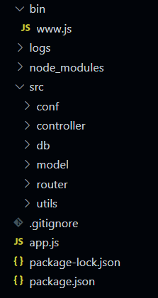

## [项目调试](#tip-1)

## [整体架构](#tip-2)

---

<a id="tip-1">项目调试</a>

- 前端 blogHtml http-server -p 8001

- 后端 nodeApi npm run dev

- 使用 ngnix 做反向代理

> nginx conf 配置

```
server {
    listen       8080;
    server_name  myBlog;
    location / {
        proxy_pass http://localhost:8001;
    }

    location /api/ {
        proxy_pass http://localhost:8000;
        proxy_set_header Host $host;
    }
}
```

---

<a id="tip-2">整体架构</a>




> 入口文件

- bin文件夹下的www.js

- app.js整合了解析query参数，body参数，集合路由等功能

> 项目日志

- logs文件夹下存放访问日志与错误日志

> 项目主要代码

- src文件夹

- conf包含环境变量，数据库连接配置清单

- controller向api提供SQL操作

- db负责数据库连接

- model整理向前端返回的数据格式

- router负责路由

- utils包含项目使用的插件


